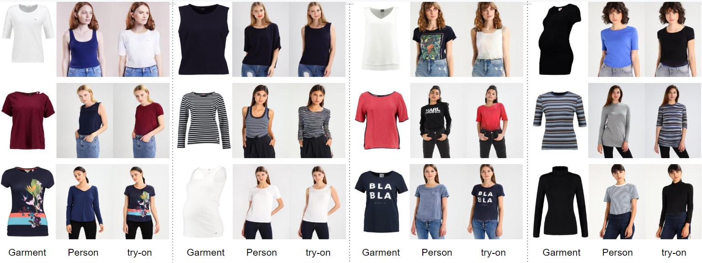

# Independent Study: Learning Virtual Try-on for Image-based Tasks
This project trains the modified [Dressing in Order (DiOr)](https://github.com/cuiaiyu/dressing-in-order) model on VITON dataset for Image-based Virtual Try-On task only without supporting the other tasks (e.g. outfit editing).




## Requirements
- python 3.6.13
- torch 1.10.1
- torchvision 0.11.2
- opencv
- visdom


## Get Started
Run
```
pip install -r requirements.txt
```


### Custom dataset/from scratch
This project is trained with the below structures:
1. human parse: [Human Parser](https://github.com/GoGoDuck912/Self-Correction-Human-Parsing) (with LIP labels)
2. pose: [Openpose](https://github.com/ZheC/Realtime_Multi-Person_Pose_Estimation)
3. dense pose: [DensePose](https://github.com/facebookresearch/DensePose)


## Training
__Warming up flownet__
We used a [Parser-Based Appearance Flow Style Estimator](https://github.com/SenHe/Flow-Style-VTON) to estimate flow field.

To warm up the flow field estimator, first download the vgg checkpoint from [here](https://github.com/senhe/flow-style-vton) and put the checkpoint under the folder ```models/networks/flowStyle```.

Then run
```
sh scripts/run_PBAFN.sh
```

__Note__: if you don't want to warmup the Estimator, you can extract the weights from [here](https://drive.google.com/drive/folders/1upRRswJf_hXldl48w5QCX7LOJp71otJB).

__Training__

After warming up the flownet, train the pipeline by running
```
sh scripts/run_train.sh
```

## Evaluations
To evaluate (SSIM, FID and LPIPS) and generate images, run
```
sh scripts/run_eval.sh
```
__Note__: Please change ```test_pairs.txt``` to ```test_pairs_same.txt``` in the code [here](https://github.com/shaoyuc3/dior-VITON/blob/28a2f7d6b59ada603e3786957863901509af344b/datasets/viton_datasets.py#L51) and [here](https://github.com/shaoyuc3/dior-VITON/blob/28a2f7d6b59ada603e3786957863901509af344b/datasets/viton_datasets.py#L130) when calculating SSIM and LPIPS.

## Results
Our generated images [\[256x192\]](https://drive.google.com/drive/folders/16RHLVxGx7kYD_YZ7MoSOlWO2TnHHXYVU).

We attained results of 0.81 for SSIM and 13.70 for FID.
