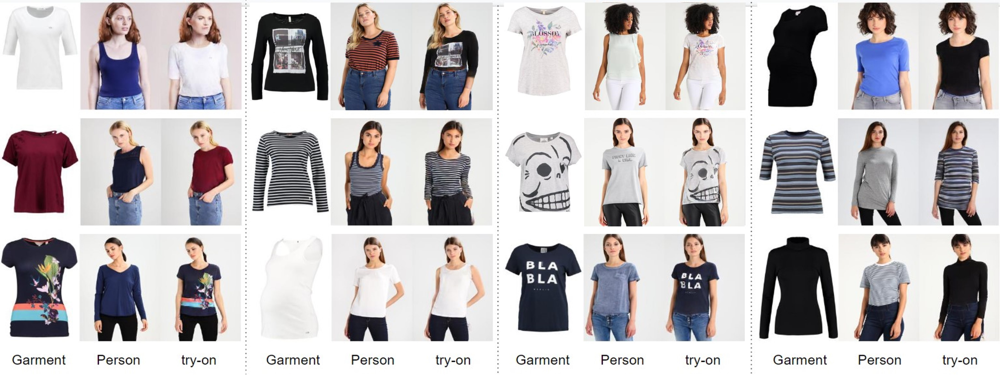

# Learning Virtual Try-on for Image-based Tasks
This project trains the modified [__Dressing in Order__ (Cui et al. ICCV 2021)](https://github.com/cuiaiyu/dressing-in-order) model on [__VITON dataset__](https://arxiv.org/abs/1711.08447) for Image-based Virtual Try-On task only without supporting the other tasks (e.g. pose transfer and outfit editing). 

To make DIOR support VITON like dataset (garment-to-person transfer), we replace
 the warper with the flow model from [__StyleFlow__ (He et al. CVPR 2022)](https://github.com/SenHe/Flow-Style-VTON/tree/main/train).
 
 #### Disclaimer
 This project is for academic research purpose only. Please be aware of the licenses of all dependencies, if you are interested in using this code. 
 
## Results
Visual results on [VITON dataset](https://arxiv.org/abs/1711.08447)


Quantitative results on [VITON dataset](https://arxiv.org/abs/1711.08447)
|   | SSIM | FID |
| ------------- | --- | --- |
| [VTON](https://arxiv.org/abs/1711.08447)  | 0.74 | 55.71 |
| [CP-VTON](https://github.com/sergeywong/cp-vton) | 0.72  | 24.45 |
| [Clothflow](https://openaccess.thecvf.com/content_ICCV_2019/papers/Han_ClothFlow_A_Flow-Based_Model_for_Clothed_Person_Generation_ICCV_2019_paper.pdf) | __0.84__ | 14.43 |
| Ours | 0.81 | __13.70__ |

More results can be found [here](https://drive.google.com/drive/folders/16RHLVxGx7kYD_YZ7MoSOlWO2TnHHXYVU).


## Get Started

### Requirements
- python 3.6.13
- torch 1.10.1
- torchvision 0.11.2
- opencv
- visdom

Run
```
pip install -r requirements.txt
```


### Custom dataset/from scratch
This project is trained with the below structures:
1. human parse: [Human Parser](https://github.com/GoGoDuck912/Self-Correction-Human-Parsing) (with LIP labels)
2. pose: [Openpose](https://github.com/ZheC/Realtime_Multi-Person_Pose_Estimation)
3. dense pose: [DensePose](https://github.com/facebookresearch/DensePose)


## Training
__Warming up flownet__

We used a [Parser-Based Appearance Flow Style Estimator](https://github.com/SenHe/Flow-Style-VTON) to estimate flow fields.

To warm up the flow field estimator, first download the vgg checkpoint from [here](https://github.com/senhe/flow-style-vton) and put the checkpoint under the folder ```models/networks/flowStyle```.

Then run
```
sh scripts/run_PBAFN.sh
```

__Note__: if you don't want to warmup the Estimator, you can extract the weights from [here](https://drive.google.com/drive/folders/1upRRswJf_hXldl48w5QCX7LOJp71otJB).

__Training__

After warming up the flownet, train the pipeline by running
```
sh scripts/run_train.sh
```

## Evaluations
To evaluate (SSIM, FID and LPIPS) and generate images, run
```
sh scripts/run_eval.sh
```
__Note__: Please change ```test_pairs.txt``` to ```test_pairs_same.txt``` in the code [here](https://github.com/shaoyuc3/dior-VITON/blob/28a2f7d6b59ada603e3786957863901509af344b/datasets/viton_datasets.py#L51) and [here](https://github.com/shaoyuc3/dior-VITON/blob/28a2f7d6b59ada603e3786957863901509af344b/datasets/viton_datasets.py#L130) when calculating SSIM and LPIPS.


## Acknowledgements
This repository is built up on [DIOR](https://github.com/cuiaiyu/dressing-in-order) and [Flow-Style-VTON](https://github.com/SenHe/Flow-Style-VTON/tree/main/train). Please be aware of their licenses when using the code.

If you find this work is helpful to you, please consider starring :star: this repo and citing the dependent work.
```
@InProceedings{Cui_2021_ICCV,
    author    = {Cui, Aiyu and McKee, Daniel and Lazebnik, Svetlana},
    title     = {Dressing in Order: Recurrent Person Image Generation for Pose Transfer, Virtual Try-On and Outfit Editing},
    booktitle = {Proceedings of the IEEE/CVF International Conference on Computer Vision (ICCV)},
    month     = {October},
    year      = {2021},
    pages     = {14638-14647}
}
```

```
@inproceedings{he2022fs_vton,
  title={Style-Based Global Appearance Flow for Virtual Try-On},
  author={He, Sen and Song, Yi-Zhe and Xiang, Tao},
  booktitle={CVPR},
  year={2022}
}
```
